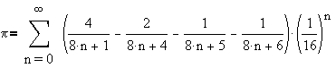

# Report of advanced Multithreading assignment

## Table of contents:

1. [Introduction](#introduction)
2. [Exercises](#exercises)
    - [Calculating-Pi](#Calculating-Pi)
    - [Semaphore-method](#Semaphore-method)
3. [Pi-Number](#Pi-Number)
    - [Total-Algorithms](#Total-Algorithms)
    - [Final-algorithm](#Final-algorithm)
4. [Semaphore](#Semaphore)
5. [References](#References)

## Introduction
This report provides the detail of the process of writing the code of 2 exercises: Calculating Pi number and handling critical sections using semaphore. After a week of research and studying different algorithms and semaphore, here is the result provided

## Exercises
### Calculating Pi number

In this exercise,I employed multiple techniques to address race conditions such as synchronize method and threadpool. I created a static method for synchronization and did the summation in that method. Then, I called the method wherever was necessairy.
I used threadpool with a fixed amount of thread to handle race condition and I used 4 threads. At first, I had the intention to used cached threadpool so there would be no need to specify the amount of threads. However, I faced some issues in my code while running the program. Also, After some comparison, I prefered to specify the amount of threads manually. So, I decided to use threadpool with fixed threads rather than cached threadpool

### Semaphore Method
Since learning semaphore was our assignment, I did some research and explored through videos in youtube, w3schools etc, to apprehend semaphore, its syntax and its usage. Luckily, it wasn't really hard to learn and to write the code. See the videos and links in references

## Pi Number
### Different algorithms for calculating Pi number
Through this week, I searched for many allgorithms and read articles about them throughout the history; from the very first algorithm to the newest one. some were efficient, some weren't.Unfortunately, the possibility to discuss all of them doesn't exist. So,in here, we mention and talk about some of them

#### Leibniz algorithm
In mathematics, the Leibniz formula for π, named after Gottfried Wilhelm Leibniz, states that:

which is an alternating series.

It is sometimes called the Madhava–Leibniz series as it was first discovered by the Indian mathematician Madhava of Sangamagrama or his followers in the 14th–15th century, and was later independently rediscovered by James Gregory in 1671 and Leibniz in 1673. The Taylor series for the inverse tangent function, often called Gregory's series, is:

The Leibniz formula is the special case for arctan 1 = π/4

It also is the Dirichlet L-series of the non-principal Dirichlet character of modulus 4 evaluated at ( s = 1 ), and therefore the value (β(1)) of the Dirichlet beta function.

### Advantages and Disadvantages of the Leibniz Formula for Calculating π

#### Leibniz Formula
The Leibniz formula for calculating π is given by:

π/4 = 1 - 1/3 + 1/5 - 1/7 + 1/9 - ...

This formula is an alternating series.

#### Advantages

1. **Simplicity**:
   - The formula is simple and easy to understand, making it an excellent example for educational purposes.
   - It only involves basic arithmetic operations: addition, subtraction, and division.

2. **Historical Significance**:
   - It has historical importance as it was discovered independently by Gottfried Wilhelm Leibniz and by the Indian mathematician Madhava of Sangamagrama.
   - It showcases the early methods developed for calculating π.

3. **Convergence for Demonstration**:
   - While the convergence is slow, it provides a straightforward way to see how series can approximate π.
   - It is useful for demonstrating the concept of series convergence and alternating series in mathematical education.

#### Disadvantages

1. **Slow Convergence**:
   - The Leibniz formula converges extremely slowly. To get just a few decimal places of π, a large number of terms must be summed.
   - For example, to get 10 correct decimal places of π, about 5 billion terms need to be summed.

2. **Inefficiency for High Precision**:
   - Due to its slow convergence, it is impractical for high-precision calculations of π.
   - Other algorithms, such as the Chudnovsky algorithm, are much more efficient for calculating many digits of π.

3. **Computational Intensity**:
   - The slow convergence makes it computationally intensive for achieving high precision.
   - It requires significant computational resources for a relatively low accuracy compared to other methods.

4. **Error Accumulation**:
   - In practical computational implementations, rounding errors can accumulate due to the large number of terms needed, potentially affecting the accuracy.

### Conclusion

While the Leibniz formula for calculating π is simple and historically significant, it is not suitable for high-precision calculations due to its very slow convergence. It remains an excellent tool for educational purposes and for illustrating the concept of series approximation.

#### Gauss-Legendre algorithm

### Gauss–Legendre Algorithm

The Gauss–Legendre algorithm is an algorithm to compute the digits of π. It is notable for being rapidly convergent, with only 25 iterations producing 45 million correct digits of π. However, it has some drawbacks, such as being computer memory-intensive, and therefore all record-breaking calculations for many years have used other methods, almost always the Chudnovsky algorithm. For details, see Chronology of computation of π.

#### Memory-Intensive Nature

The Gauss–Legendre algorithm is memory-intensive for several reasons:

1. **Multiple Sequences**:
   - The algorithm involves iterating multiple sequences, such as \( a_n \), \( b_n \), and \( t_n \), which all need to be stored at each step.
   - Each of these sequences requires precise arithmetic with very large numbers.

2. **Precision Management**:
   - As the iterations progress, the precision of the calculations must increase to maintain accuracy.
   - This means that more memory is required to store these increasingly precise numbers.

3. **Intermediate Calculations**:
   - The algorithm computes several intermediate values, including arithmetic and geometric means, which require additional storage space.
   - These intermediate values need to be kept in memory throughout the computation process.

4. **Large Numbers**:
   - The nature of π calculation involves handling extremely large numbers and floating-point precision, which consumes significant amounts of memory.

#### Detailed Steps of the Gauss–Legendre Algorithm

Here’s a brief overview of the algorithm, highlighting where memory usage becomes intensive:

1. **Initialization**:
   - \( a_0 = 1 \)
   - \( b_0 = \frac{1}{\sqrt{2}} \)
   - \( t_0 = \frac{1}{4} \)
   - \( p_0 = 1 \)

2. **Iteration**:
   - Compute \( a_{n+1} = \frac{a_n + b_n}{2} \)
   - Compute \( b_{n+1} = \sqrt{a_n b_n} \)
   - Compute \( t_{n+1} = t_n - p_n(a_n - a_{n+1})^2 \)
   - Update \( p_{n+1} = 2 p_n \)

Each of these steps requires high-precision arithmetic operations and the storage of multiple large floating-point numbers, which exponentially increase the memory requirements.

#### Memory Management Challenges

1. **Precision Tracking**:
   - High precision numbers (with millions of digits) are needed to ensure the accuracy of the results, and managing these numbers requires considerable memory.
   - Libraries or software that handle arbitrary-precision arithmetic (like GMP) need to dynamically allocate memory, which can lead to high memory usage.

2. **Intermediate Results Storage**:
   - During the iterations, the intermediate results from each step must be kept in memory until the final value of π is computed.
   - This accumulation of data further adds to the memory load.

#### Comparison with Other Algorithms

The Chudnovsky algorithm, in contrast, is less memory-intensive because it involves fewer intermediate sequences and can be optimized more effectively for modern computer architectures. It primarily uses series expansion and is more efficient in terms of both time and space.

### Conclusion

The Gauss–Legendre algorithm's rapid convergence is offset by its heavy memory demands, which arise from the need to store and manipulate multiple high-precision sequences and intermediate values throughout the iterative process. This makes it less suitable for extremely high-precision calculations of π where memory efficiency is crucial.

### Chudnovsky algorithm

The Chudnovsky algorithm is a fast method for calculating the digits of π, based on Ramanujan's π formulae. Published by the Chudnovsky brothers in 1988,[1] it was used to calculate π to a billion decimal places.[2]

It was used in the world record calculations of 2.7 trillion digits of π in December 2009,[3] 10 trillion digits in October 2011,[4][5] 22.4 trillion digits in November 2016,[6] 31.4 trillion digits in September 2018–January 2019,[7] 50 trillion digits on January 29, 2020,[8] 62.8 trillion digits on August 14, 2021,[9] 100 trillion digits on March 21, 2022,[10] and 105 trillion digits on March 14, 2024.[11]

The algorithm is based on the negated Heegner number d = 163,the j function and on the following rapidly convergent generalized hypergeometric series:

A detailed proof of this formula can be found here.

This identity is similar to some of Ramanujan's formulas involving π and is an example of a Ramanujan–Sato series.
Time Complexity of the algorithm is 

This makes the Chudnovsky algorithm highly efficient for calculating large numbers of digits of π, contributing to its use in setting multiple world records for π computation.

#### Bailey–Borwein–Plouffe formula

The Bailey–Borwein–Plouffe formula (BBP formula) is a formula for π. It was discovered in 1995 by Simon Plouffe and is named after the authors of the article in which it was published, David H. Bailey, Peter Borwein, and Plouffe.[1] Before that, it had been published by Plouffe on his own site.[2] The formula is mentioned above

### Advantages and Disadvantages of the BBP Formula for Calculating π

#### BBP Formula
The BBP (Bailey–Borwein–Plouffe) formula for π is given by:

This formula allows for the direct computation of binary or hexadecimal digits of π without needing to calculate the preceding digits, a property known as "digit extraction."

#### Advantages

1. **Digit Extraction**:
   - The BBP formula enables the extraction of individual hexadecimal or binary digits of π without needing to compute all preceding digits.
   - This property is particularly useful for verifying individual digits of π independently of previous calculations.

2. **Rapid Convergence**:
   - The BBP formula converges relatively quickly compared to other series formulas.
   - It provides an efficient way to compute π to many decimal places.

3. **Algorithmic Simplicity**:
   - The formula's structure lends itself well to parallel computation, making it efficient for modern computer architectures.
   - Its simplicity in form allows for straightforward implementation in various programming languages.

4. **Significance in Computational Mathematics**:
   - The discovery of the BBP formula in 1995 was significant as it was the first formula of its kind to allow digit extraction.
   - It led to further research and discovery of similar formulas for other constants.

#### Disadvantages

1. **Hexadecimal and Binary Limitation**:
   - The digit extraction property works naturally for binary and hexadecimal digits but not directly for decimal digits.
   - Conversion from binary/hexadecimal to decimal may be required, adding complexity.

2. **Complexity in Generalization**:
   - Generalizing the BBP formula for other bases or for other constants is non-trivial and may not always be possible.
   - Finding similar formulas for other constants or in different number bases requires significant mathematical effort.

3. **Resource Intensity for Extremely High Precision**:
   - While the BBP formula is efficient for high precision, extremely high precision calculations can still be resource-intensive.
   - The memory and computational power required can become substantial as more digits are calculated.

4. **Specialized Use Case**:
   - The BBP formula is highly specialized for digit extraction and rapid convergence in binary/hexadecimal.
   - For general-purpose π calculation in decimal, other algorithms like the Chudnovsky algorithm may be preferred for their efficiency and simplicity in decimal digit computation.

### Conclusion

The BBP formula for calculating π is notable for its digit extraction property and relatively rapid convergence, making it efficient for high-precision calculations and parallel computation. However, its limitations in direct decimal digit extraction and resource intensity for extremely high precision make it less versatile than some other algorithms for general-purpose π calculations.

#### Final algorithm
### Selection of BBP Formula

Considering the strengths and weaknesses of each algorithm, the BBP (Bailey–Borwein–Plouffe) formula emerges as the preferred choice for certain applications, especially those requiring rapid computation of π to high precision or direct extraction of binary or hexadecimal digits.

#### Efficiency and Rapid Convergence:
The BBP formula offers efficient convergence, allowing for the calculation of π to high precision with relatively few iterations. Its rapid convergence makes it particularly valuable for applications where speed is essential, such as real-time computations or large-scale simulations.

#### Digit Extraction Property:
One of the unique features of the BBP formula is its ability to extract individual hexadecimal or binary digits of π without needing to compute all preceding digits. This property is highly advantageous for tasks that involve working directly with binary or hexadecimal representations of π, such as cryptography or digital signal processing.

#### Significant Contributions to Computational Mathematics:
The discovery of the BBP formula in 1995 was a breakthrough moment in computational mathematics. It represented the first formula of its kind to enable digit extraction for π, opening up new possibilities for research and applications in various fields. Its digit extraction property has paved the way for further discoveries and innovations in numerical analysis and algorithm development.

#### Versatility and Practicality:
While the BBP formula is specialized for digit extraction and rapid convergence, it also offers versatility in implementation. Its algorithmic simplicity and suitability for parallel computation make it practical for a wide range of computational tasks, from scientific computing to software development.

#### Conclusion:
In summary, the BBP formula stands out as a preferred choice for its efficiency, rapid convergence, digit extraction property, and significant contributions to computational mathematics. Its unique features make it an invaluable tool for various applications, from high-performance computing to cryptographic protocols. Therefore, the BBP formula is selected for its practicality, versatility, and groundbreaking advancements in numerical computation.

## Semaphores

A semaphore is a synchronization primitive in operating systems and concurrent programming that is used to control access to a shared resource by multiple processes or threads. It acts as a signaling mechanism, allowing threads to coordinate their actions and avoid conflicts when accessing shared resources.

### How Semaphores Work:
- **Counting Mechanism**: Semaphores maintain an internal counter that represents the number of available resources or permits.
- **Acquiring and Releasing**: Processes or threads can acquire (lock) or release (unlock) a semaphore to access or release the shared resource.
- **Blocking and Unblocking**: When a semaphore is acquired, if the counter is zero (meaning no resources are available), the acquiring thread may be blocked until a resource becomes available. When a resource is released, the semaphore unblocks waiting threads, allowing them to acquire the resource.

### Types of Semaphores:
1. **Binary Semaphores**: Also known as mutexes, they have two states: locked (1) or unlocked (0). They are typically used for mutual exclusion to control access to a single resource.
2. **Counting Semaphores**: They can have multiple states, representing the number of available resources or permits. They are used to control access to a pool of identical resources.

### Use Cases of Semaphores:
1. **Resource Allocation**: Semaphores are used to manage access to shared resources such as files, databases, or hardware devices, ensuring that only one thread or process can access the resource at a time.
2. **Producer-Consumer Problem**: Semaphores can coordinate the interactions between producers and consumers in a shared buffer, ensuring that producers do not add data to a full buffer and consumers do not consume from an empty buffer.
3. **Readers-Writers Problem**: Semaphores can control access to a shared data structure, allowing multiple readers or a single writer to access it concurrently while preventing concurrent access by readers and writers.
4. **Thread Synchronization**: Semaphores are used to synchronize the execution of threads in multithreaded applications, ensuring that critical sections of code are executed atomically and in the correct order.
5. **Task Synchronization**: In real-time systems, semaphores are used to synchronize the execution of tasks or processes, ensuring that they execute in a coordinated manner and meet timing constraints.

### Conclusion:
Semaphores are a fundamental synchronization primitive in concurrent programming, providing a simple yet powerful mechanism for coordinating access to shared resources and ensuring thread safety. They are widely used in operating systems, parallel computing, and real-time systems to manage concurrency and prevent race conditions.

## References
Here are the links and references used to do this assignment for further readings.

[Introduction to Java Semaphores](https://www.youtube.com/watch?v=g19pjkJyGEU)

[Multithreading in java explained in 10 minutes](https://www.youtube.com/watch?v=r_MbozD32eo&pp=ygUgbXVsdGl0aHJlYWRpbmcgc2VtYXBob3JlIGluIGphdmE%3D)

[Calculate Pi using Nilkantha’s series](https://www.geeksforgeeks.org/calculate-pi-using-nilkanthas-series/)

[Bellards formula](https://en.wikipedia.org/wiki/Bellard%27s_formula)

[How is Pi calculated?](https://stackoverflow.com/questions/2654749/how-is-pi-%CF%80-calculated)

